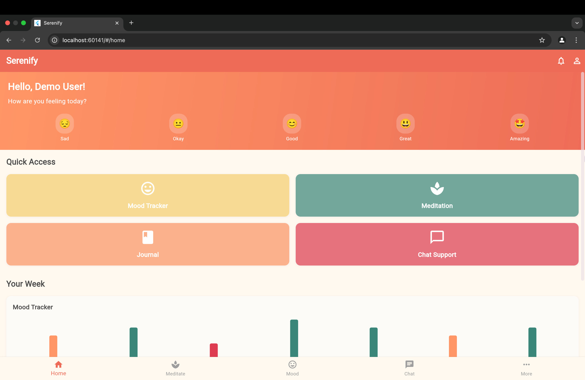
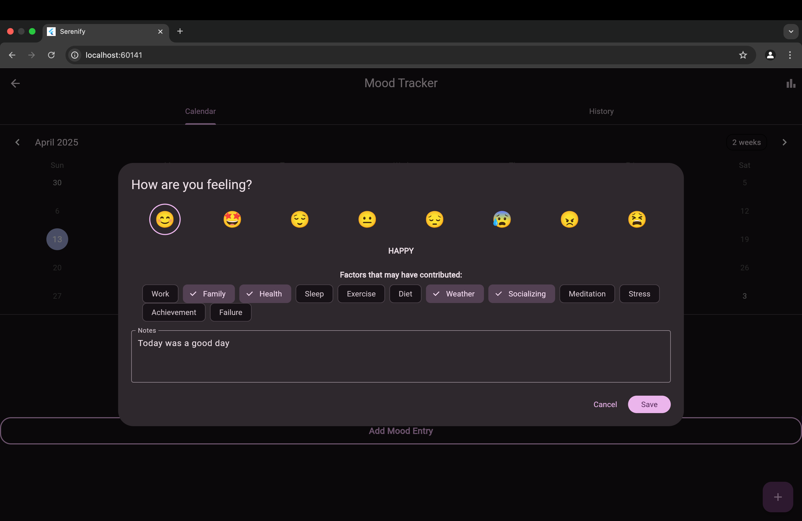
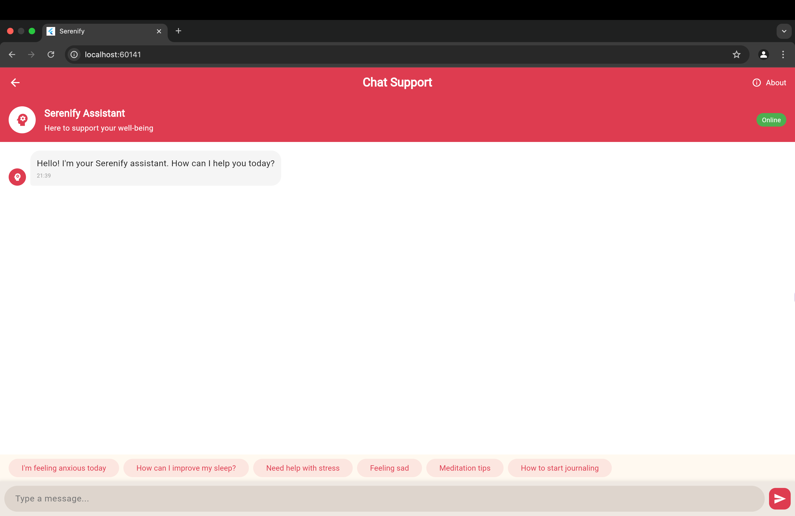
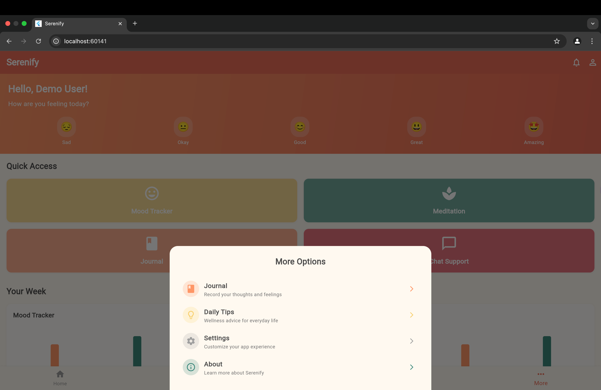
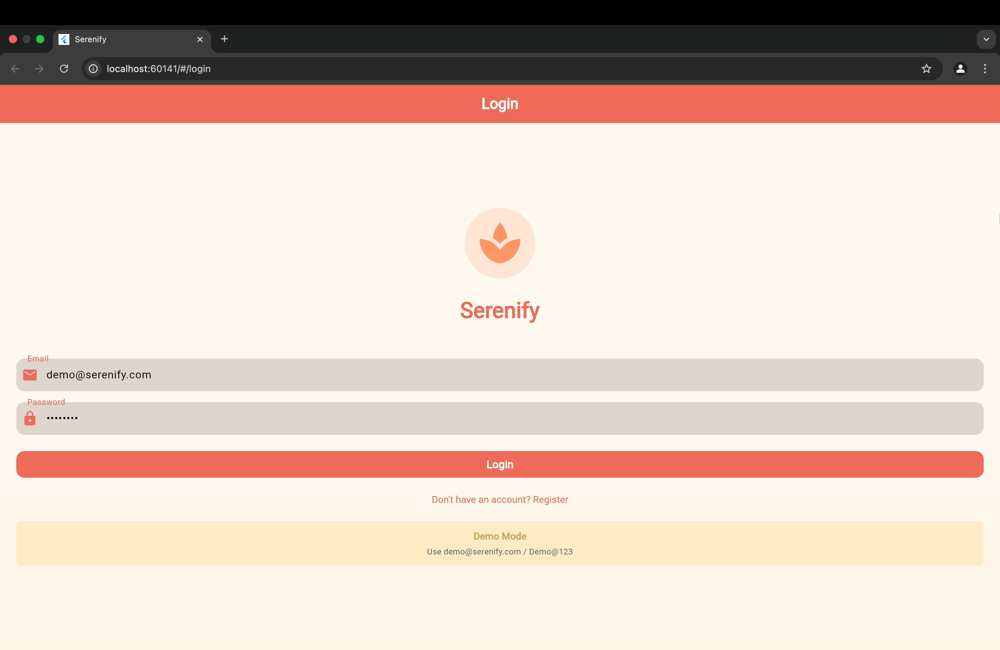
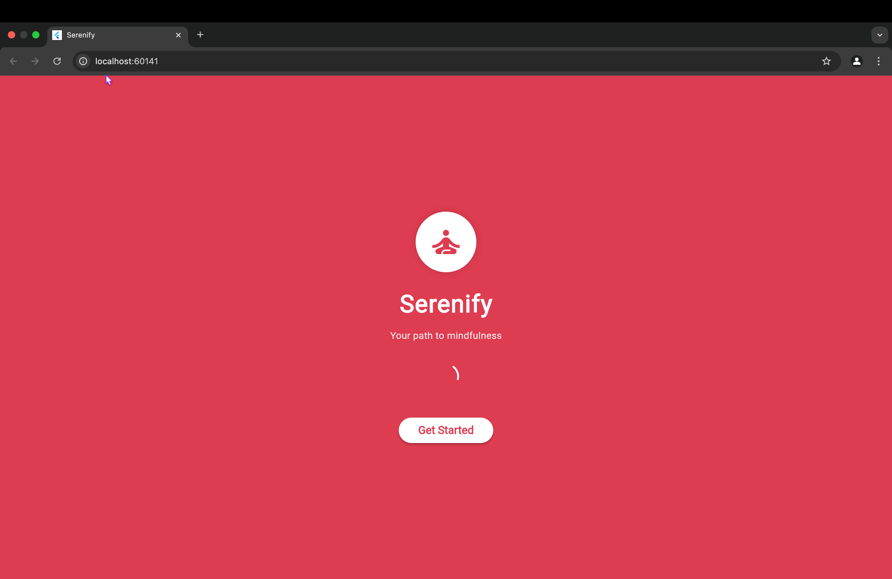

# Serenify

<p align="center">
  
</p>

## Overview

Serenify is a comprehensive mental health companion app designed to help users track their mood, manage stress, and improve their overall mental well-being. With a user-friendly interface and powerful features, Serenify provides personalized support for your mental health journey.

## Features

### Core Features

- **Mood Tracking**: Monitor daily emotions and identify patterns over time
- **Interactive Journal**: Document thoughts, feelings, and experiences
- **AI-Powered Chat Support**: Get instant mental health guidance and support
- **Guided Meditation**: Access a variety of mindfulness exercises
- **Emergency Resources**: Quick access to crisis hotlines and support contacts
- **Detailed Analytics**: Visualize your mental health journey with charts and statistics

### Advanced Features

- **Personalized Recommendations**: Receive customized suggestions based on your mood patterns
- **Comprehensive Resource Library**: Access articles, videos, and tools for mental wellness
- **Daily Exercises**: Practice evidence-based therapeutic techniques
- **Progress Tracking**: Set goals and monitor your improvement
- **Customizable Experience**: Tailor the app to your specific needs

### Technical Features

- **Offline Functionality**: Access core features without internet connection
- **Multi-language Support**: Available in multiple languages
- **Dark Mode**: Eye-friendly interface for day and night use
- **Secure Data Handling**: End-to-end encryption and local authentication
- **Cross-Platform Compatibility**: Works seamlessly on iOS and Android devices

## Screenshots

## Screenshots

<div align="center">
  
  
  <br/>
  
  
  <br/>
  
  
</div>

## Technology Stack

- **Frontend**: Flutter SDK
- **Backend Services**: Firebase (Authentication, Firestore, Analytics, Storage)
- **State Management**: Provider
- **Authentication**: Firebase Auth with biometric integration
- **Data Visualization**: fl_chart
- **Responsive Design**: responsive_framework
- **Animations**: flutter_animate, Lottie
- **Localization**: flutter_localizations, intl

## Getting Started

### Prerequisites

- Flutter SDK (>=3.0.0)
- Dart SDK (>=3.0.0)
- Android Studio / Xcode
- Firebase account
- Git

### Installation

1. Clone the repository:
   ```bash
   git clone https://github.com/yourusername/serenify.git
   cd serenify
   ```

2. Install dependencies:
   ```bash
   flutter pub get
   ```

3. Configure Firebase:
   - Create a Firebase project in the Firebase Console
   - Add your app to the Firebase project
   - Download `google-services.json` and add to `android/app/`
   - Download `GoogleService-Info.plist` and add to `ios/Runner/`

4. Set up environment variables:
   - Create a `.env` file in the root directory based on `.env.demo`
   - Add required API keys and configuration values

5. Run the app:
   ```bash
   flutter run
   ```

## Project Structure

```
lib/
├── config/         # App configuration
├── constants/      # App constants and configurations
├── models/         # Data models
├── providers/      # State management
├── screens/        # UI screens
├── services/       # Business logic and API calls
├── themes/         # App theming
├── utils/          # Utility functions
└── widgets/        # Reusable UI components
```

## Key Screens

- **Home**: Dashboard with quick access to all features
- **Mood Tracker**: Record and visualize your daily mood
- **Journal**: Private space to document thoughts and feelings
- **Chat Support**: AI-powered conversational support
- **Meditation**: Guided mindfulness exercises
- **Resources**: Library of mental health content
- **Profile**: User settings and preferences
- **Emergency**: Quick access to crisis resources

## Development

### Build for Development

```bash
flutter run --debug
```

### Build for Testing

```bash
flutter test
```

### Build for Release

#### Android
```bash
flutter build apk --release
# OR
flutter build appbundle --release
```

#### iOS
```bash
flutter build ios --release
# Then archive using Xcode
```

## Contributing

We welcome contributions to Serenify! Please follow these steps:

1. Fork the repository
2. Create your feature branch (`git checkout -b feature/amazing-feature`)
3. Commit your changes (`git commit -m 'Add some amazing feature'`)
4. Push to the branch (`git push origin feature/amazing-feature`)
5. Open a Pull Request

Please ensure your code follows our style guidelines and passes all tests.

## Code Standards

- Follow Flutter best practices
- Write meaningful commit messages
- Include comments where necessary
- Write tests for new features
- Ensure accessibility compliance

## Security and Privacy

Serenify takes user privacy seriously:

- All sensitive data is encrypted
- Support for biometric authentication
- No third-party data sharing without consent
- Compliance with privacy regulations
- Regular security audits

## Roadmap

- [ ] Community support groups
- [ ] Professional therapist connection
- [ ] Expanded analytics with more insights
- [ ] Integration with health tracking devices
- [ ] Gamification elements for engagement

## License

This project is licensed under the MIT License - see the [LICENSE](LICENSE) file for details.

## Support

For support, please:
- Email: support@serenify.com
- Open an issue in the repository
- Visit our support site: [support.serenify.com](https://support.serenify.com)

## Acknowledgments

- Flutter team for the amazing framework
- Firebase for backend services
- All open source libraries used in the project
- Our beta testers and early adopters
- Mental health professionals who provided guidance# Serenify
